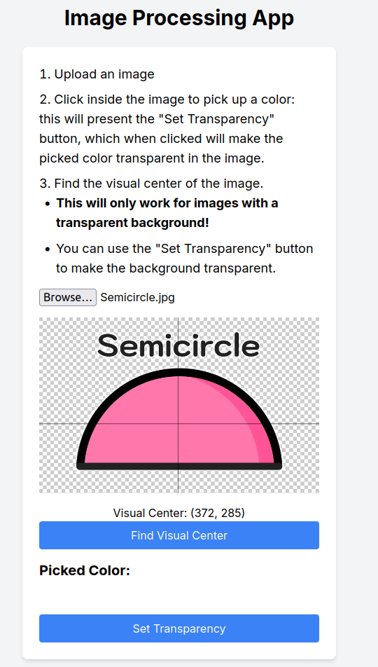

# _image_transparency_and_center

## Structure, lang and frameworks

 - `backend/`: API built with python, Flask and Pillow
 - `front/`: frontend built with nextjs/react

## Running

- `docker compose up --build` and then access the front-end at `http://localhost:3000/`
    - **make sure your ports `3000` and `5000` are not already in use on the host machine**

- if you want to run outside docker
    - install the pip and npm dependencies
    - inside `backend/`: `python3 app/main.py`
    - inside `front/`: `npm run dev`

 -  There's a few unit tests inside `backend/tests`, you can run then with `PYTHONPATH=./ pytest tests/main_test.py -s` inside the backend container `app/` folder

## Decisions

This is a toy app, and there's a lot of "red flags" if we were looking for something real - I kept things extra simple and constrained the problem such that it wouldn't take too much time building it, while still displaying the assesment main ideas. I'm haptty to chat about details o "things that we could improve in a real scenario". 

### Visual center computation

I implemented a simple (and very unoptimized) algorithm that finds the "center point" of the image given the distribution of intensity a cross all pixels - i.e. the point that dives four quadrants and where their density is "balanced". 
Of course, computing this for the complete image would simply give us its "normal" center - thus I constrained the problem in that **it only works for an image that contains a transparent background surrounding the image**. 

We could make things more sophisticated by finding the countour of the inner images and applying a mask to the background automatically and without any transparency, but I decided to keep things simple. I suspect there's also a more clever way of implementing this by normalizing the pixels against the dominant background colour, but I couldn't formulate any exact solution from this concept.

## Pic of the app

